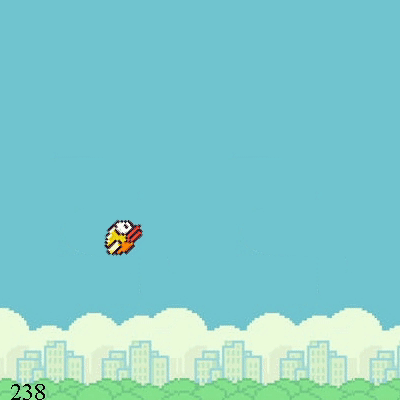

## Flappy Bird IA



## Usage

```
Use netbenas to open the project
```


Algoritmo genetico que trabaja sobre el juego de FlappyBird. Basicamente se calculan los pesos del perceptron usando un algoritmo genetico. El uso principal de este proyecto es de aprendizaje, y de ver el comportamiendo del algoritmo dado los diferentes valores de entrada proporcionados.
